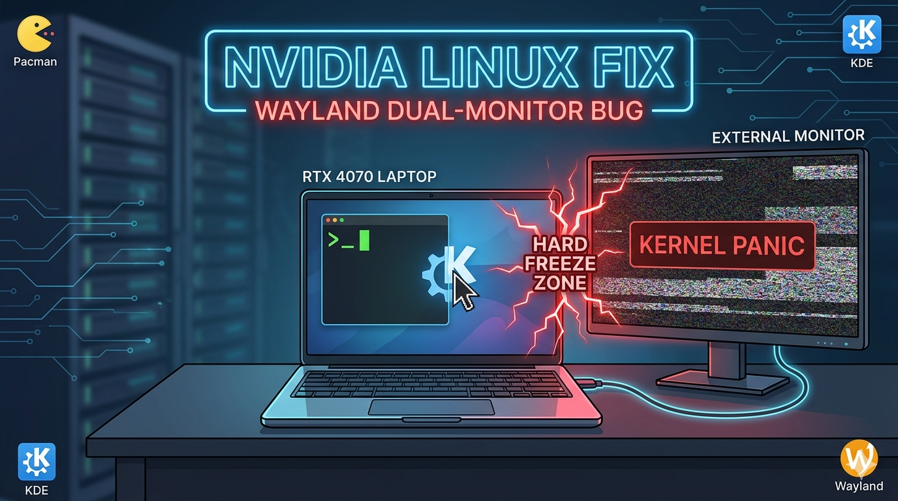

## *The "Cursor of Death": Fixing the NVIDIA Multi-Monitor Freeze*

If you are running a modern Linux setup with **NVIDIA graphics** and **Wayland**, you’ve likely enjoyed the smooth animations and tear-free experience of 2026’s latest kernels. However, for many hybrid laptop users (Intel/AMD + NVIDIA), a frustrating bug recently turned the simple act of moving a mouse into a system-breaking event.

## The Symptom: The "Boundary Freeze"

The scenario is oddly specific: You connect an external monitor to your laptop (e.g., via HDMI or USB-C/DisplayPort). Everything looks perfect. But the moment your mouse cursor crosses the boundary from your built-in laptop screen to the external monitor—**Hard Freeze.** No TTY access, no "Magic SysRq" keys—just a total system lockup that requires a physical power cycle.

## The Root Cause: NVIDIA Driver 580.142

After extensive debugging on a **CachyOS** system running **KDE Plasma 6.6**, the culprit was identified: the NVIDIA driver version **580.142**.

On hybrid laptops (like those with an RTX 4070), the internal display is usually driven by the integrated GPU (iGPU), while external ports are wired to the NVIDIA dGPU. Version 580.142 introduced a regression in the "Shared Buffer" handshake. When the cursor moves between GPUs, the driver fails to synchronize the framebuffers, leading to an immediate kernel panic.

---

## The Solution: A Controlled Downgrade to Stability

Since standard updates haven't patched this yet, the most reliable fix is a synchronized downgrade to the previous stable version: **580.126**.

### Step 1: Identify the Full Driver Stack
NVIDIA drivers are highly modular. You cannot downgrade just the kernel module; you must downgrade the entire stack to keep dependencies in sync. Check your installed packages first:

```bash
sudo pacman -Qs nvidia
```

### Step 2: Synchronized Downgrade
We use the `downgrade` utility to revert all components simultaneously to version **580.126.18-1**.

**The Command:**
```bash
sudo downgrade nvidia-580xx-dkms nvidia-580xx-utils lib32-nvidia-580xx-utils opencl-nvidia-580xx lib32-opencl-nvidia-580xx
```

> **Important:** Select version `580.126.18-1` for **every** package in the list. When asked "Add [package] to IgnorePkg?", answer **Yes (y)**. This prevents `pacman -Syu` from automatically reinstalling the broken version.

### Step 3: Enable Early KMS & Rebuild Initramfs
To ensure the kernel initializes the NVIDIA drivers correctly before the Desktop Environment loads, we must verify the "Early KMS" settings.

Check your `/etc/mkinitcpio.conf` and ensure the modules line includes:
`MODULES=(nvidia nvidia_modeset nvidia_uvm nvidia_drm)`

Then, regenerate your initramfs images:
```bash
sudo mkinitcpio -P
```

### Step 4: The Software Cursor Fallback
As an extra layer of protection against Wayland-specific cursor crashes, you can force the system to render the cursor via software. Add the following line to your `/etc/environment` file:

```text
WLR_NO_HARDWARE_CURSORS=1
```

---

## Conclusion

After a reboot, verify your version using `nvidia-smi`. Once you are back on **580.126**, the "Boundary Freeze" should be a thing of the past. Your cursor can now freely roam between monitors without bringing the whole system down.

While the relationship between Linux and NVIDIA remains "complicated" in 2026, a calm head and a targeted downgrade are often all you need to get back to work.