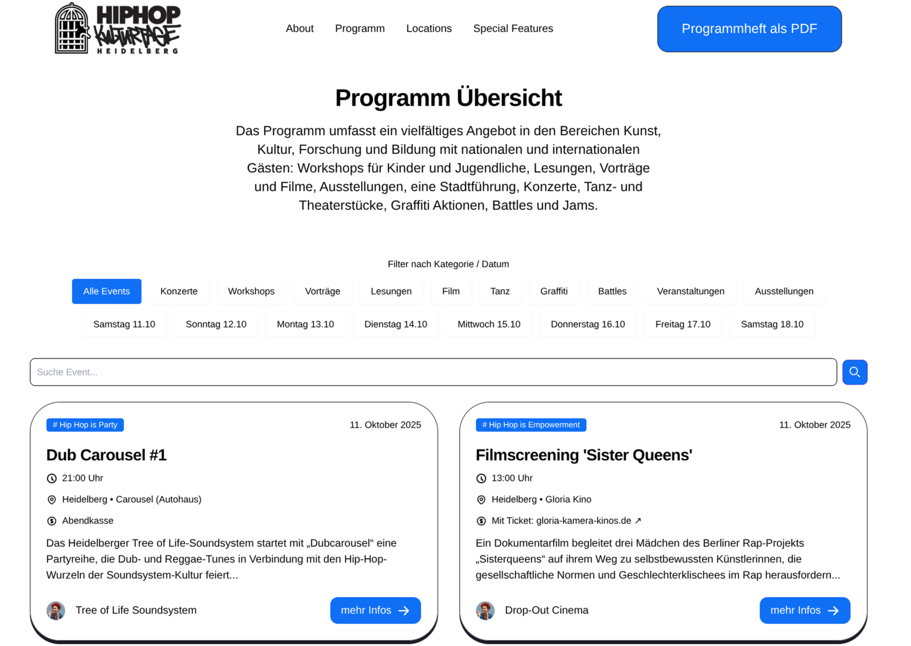
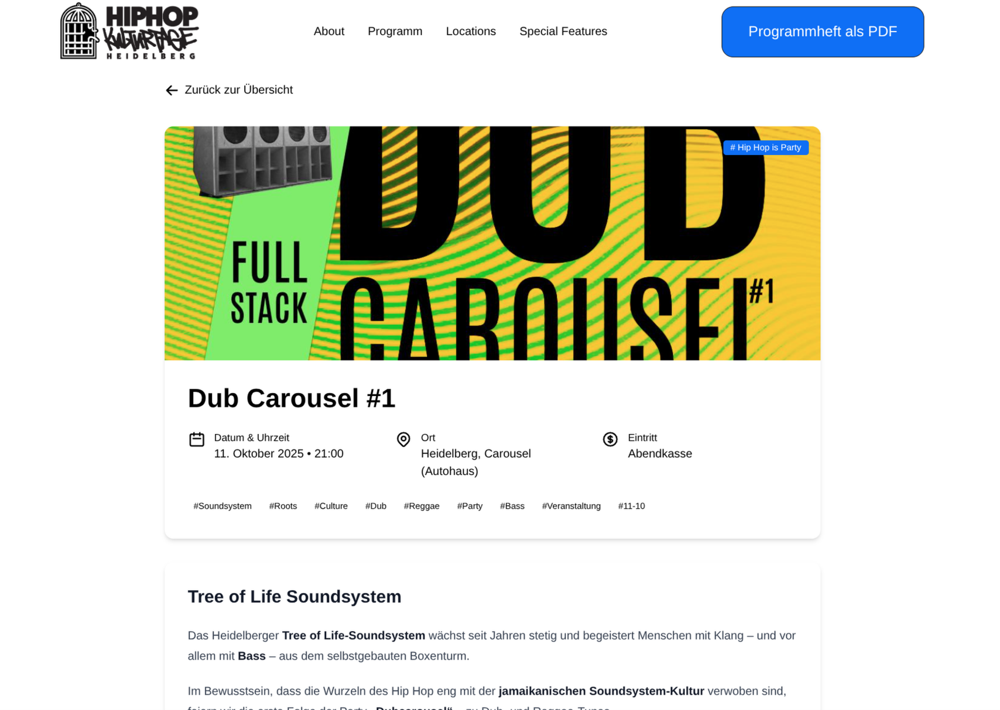
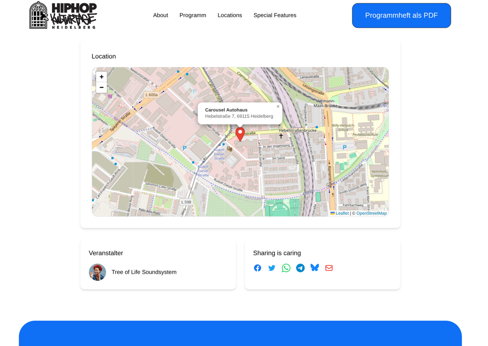
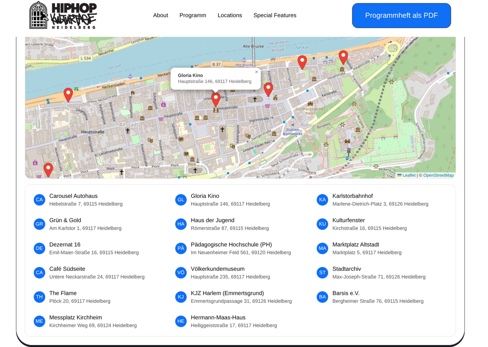
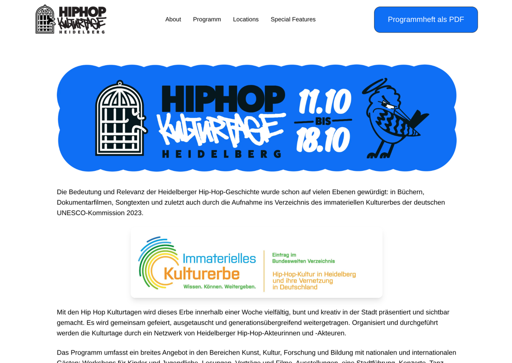
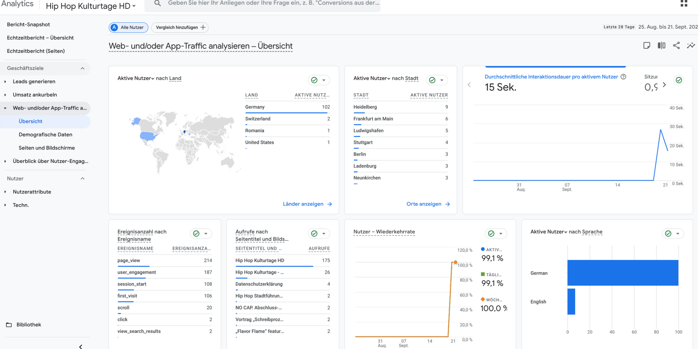

# Building the Website for Heidelberg’s First Hip Hop Culture Days  

This project was a bit of a passion piece for me. A while back, some friends from the Heidelberg hip hop scene asked if I could build them a website for their very first Hip Hop Culture Days. When the time finally came, I was all in.  

For the framework, I naturally gravitated back to **Astro**. I picked out a sleek template with a hint of **neo-brutalism design**, pitched it to the organizing committee, and walked them through my ideas for customizing the pre-styled UI elements.  

## The Goal  
The initial plan was simple:  
1. Create a **landing page** with logo and a short intro explaining what the Culture Days are all about.  
2. Once the final program was ready, roll out a **major update** featuring all events, locations, and special highlights.  

The big challenge: about **40 events** needed to be displayed in a way that was both clear and responsive. I also wanted to integrate **OpenStreetMaps** for navigation.  

## Structuring the Events  
I realized the existing blog feature was perfect for this. The article cards already had solid **UI/UX**, so I only needed a few tweaks to handle extra details like price, location, and description.  

Each event was structured with frontmatter like this:  

```yaml
---
title: "Dub Carousel #1"
pubDate: 2025-10-11
time: "21:00"
author: 'Tree of Life Soundsystem'
locations: ['Heidelberg', 'Carousel (Autohaus)']
entryFee:
  description: 'Abendkasse'
detailedEntryFee: 'Abendkasse'
authImage: 'https://flowbite.s3.amazonaws.com/blocks/marketing-ui/avatars/bonnie-green.png'
image: '/tree_of_life_soundsystem.jpg'
tags: ['soundsystem', 'roots', 'culture', 'dub', 'reggae', 'party', 'bass', 'veranstaltung', '11-10']
slug: 11-10-dub-carousel
summary: "Das Heidelberger Tree of Life-Soundsystem startet mit „Dubcarousel“ eine Partyreihe..."
type: "Hip Hop is Party"
---
```

It took me about **two evenings after work** to enter all the events with their metadata, but once it was done, the whole structure clicked.

## Filtering and Searching

Scrolling through 40 events on a phone (in a 1-column layout) isn’t exactly fun. So I built a simple **filtering system**:

* Buttons for tags like *concert, workshop, battle, jam*.
* Date-based filters, so people could quickly jump to what’s happening on, say, October 14th.
* A full-text **search function** for backup.



## Event Pages and Styling

The template didn’t come with much styling for individual blog posts, so I rolled up my sleeves and built a new **UI with TailwindCSS**. Each event page now shows all metadata, plus extras like **share buttons** and a **map with the event location**.

Thanks to some AI-assisted coding (and a few syntax hiccups along the way), I got this done in about **half a day**.




## Making Maps Reusable

When building the map component, I remembered some advice from an old senior dev: *“Make it reusable.”*

So instead of just throwing in a one-off map, I created a component that could:

* Display a **single event location** with a marker.
* Be reused on a **locations overview page**, complete with buttons that zoom directly to each spot.

Here’s a snippet of the locations data:

```js
const heidelbergLocations = [
  { id: "hd-car-1", name: "Carousel Autohaus", address: "Hebelstraße 7, 69115 Heidelberg", lat: 49.396849851638926, lng: 8.680147697801925 },
  { id: "hd-glo-1", name: "Gloria Kino", address: "Hauptstraße 146, 69117 Heidelberg", lat: 49.41179625945299, lng: 8.707305626638524 },
  { id: "hd-ksb-1", name: "Karlstorbahnhof", address: "Marlene-Dietrich-Platz 3, 69126 Heidelberg", lat: 49.38683255004057, lng: 8.681163084309357 },
  // ...and many more
];
```

And how it looks embedded:

```jsx
<Maps
  id="map-locations"
  center={[49.3988, 8.6724]}
  zoom={20}
  locations={heidelbergLocations}
  height="520px"
  interactiveList={true}
  singleMarker={false}
  scrollWheelZoom={true}
  geocodeOnClient={true}
  markerIconUrl="/images/map/marker-google.svg"
/>
```



## The Final Stretch

Before I integrated the map, we had another **team meeting** where I showed the current progress. The feedback was overwhelmingly positive — lots of encouragement and excitement.

At that point, I asked all crews and organizers to send me their **typo fixes or last-minute changes** by 8 PM the next day. That night turned into a bit of a grind. There were more edits than expected, and it was tedious to go through everything. But by the deadline, I had implemented all changes and also managed to roll out the new **map functionality**.

Everyone on the team had access to a **staging server** running off the dev branch on Netlify. The plan was to merge the big PR into main later that evening and go live before midnight.

And honestly — it all worked like a charm.
No conflicts, smooth redeployment, and a happy team.



## Going Live and Tracking Impact

During the meeting, we also agreed to **synchronize our Instagram push** on Sunday. The day before, I took care of some **legal essentials** (privacy policy, imprint) and — since I was already in the zone — added **Google GA4** to track traffic.

When we launched, everything clicked. Since Sunday evening I’ve been glued to the real-time analytics dashboard, watching people pour in from Instagram and explore the site.



## Takeaways

This project was special. Not just because of what it was for, but because of what I learned:

* Planning, communication, and team feedback loops.
* Building and iterating quickly with Astro, Tailwind, and AI-assisted coding.
* Managing **CI/CD** through Git workflows and Netlify deployments.

Seeing it all come together confirmed something important for me: the years I’ve invested in teaching myself in fullstack development are starting to really pay off. And I’m pretty sure this won’t be the last project that comes out of it.

[Check out hiphopkulturtage.de](https://hiphopkulturtage.de)
